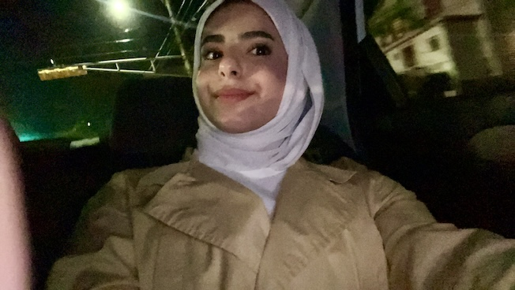

## Hi there 👋
### My Name?  
- My name is 🌸**Rayan Alqahtani**🌸 
### Selfie 🤳 🧀

### Background...
- I am a **4th year** **Neurosceince** student 👩🏻‍🎓🧠
- I enrolled in this class because I want to develop my skills in **coding** 👩🏻‍💻 and learn to interpret **data** 📈 related to neuroscience.
- I have always been **fascinated** 🧐 by the brain and how and why people develop certain disorders or diseases, and I 💕 **love** 💕 the details of brain pathways, such as the ones that lead to addiction or loss of movement in limbs. 🦿
- My career plan is to get into **medical school** 🩺 and maybe become a neurologist? its still to early to decide on that 😅
-----
*Byeee* ✌🏻
<!--
**RayanAlQahtani/RayanAlQahtani** is a ✨ _special_ ✨ repository because its `README.md` (this file) appears on your GitHub profile.

Here are some ideas to get you started:

- 🔭 I’m currently working on ...
- 🌱 I’m currently learning ...
- 👯 I’m looking to collaborate on ...
- 🤔 I’m looking for help with ...
- 💬 Ask me about ...
- 📫 How to reach me: ...
- 😄 Pronouns: ...
- ⚡ Fun fact: ...
-->
